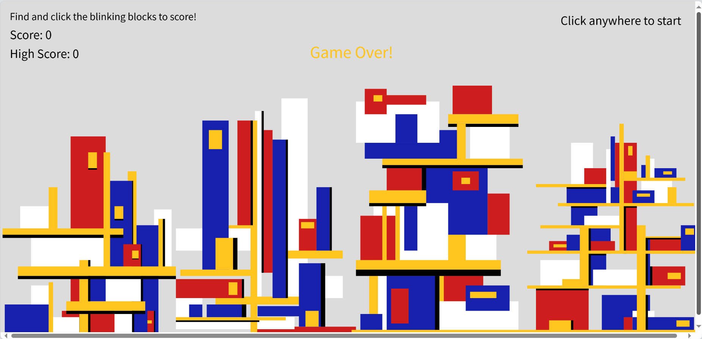
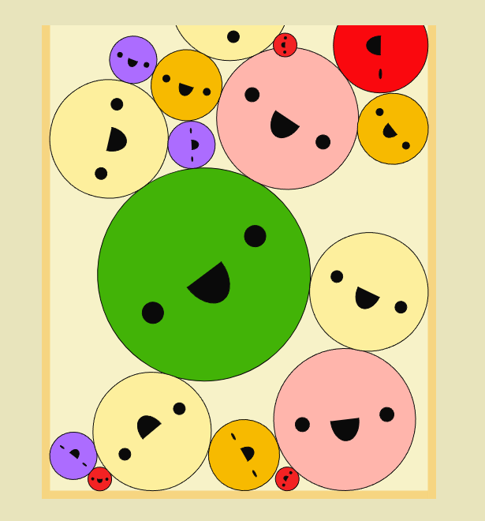
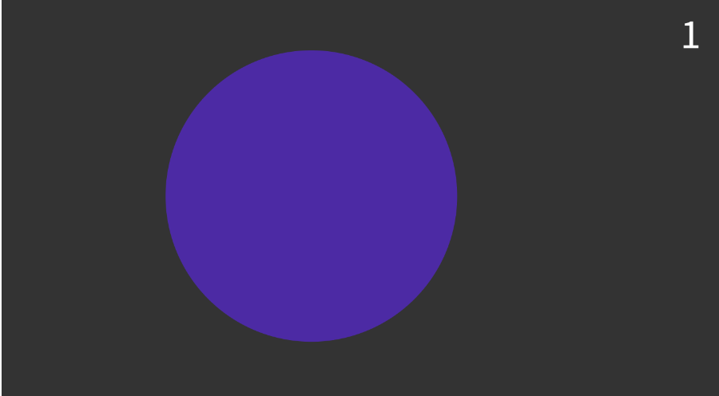

# Functioning Prototype
## Interactive Building Game
This is a clicking game based on our group abstract building structures.

## How to Play

### Basic Gameplay
- Look for randomly blinking blocks in the buildings
- Click on any blinking block to score points
- Each successful click adds 1 point to your score
- Try to achieve the highest score possible in 30 seconds!

### Game Controls
- Click anywhere to start a new game
- Use your mouse to target and click blinking blocks
- No keyboard controls needed - it's all mouse-based interaction

### Game UI
- Score and Instruction  is displayed in the top-left corner
- Time remaining shows below your score
- High score is tracked between games

### Tips
- The blinking block could appear anywhere in any building
- A small tolerance is added around each block to make clicking easier
- Focus on quick identification and accurate clicking
- Try to spot the next blinking block as soon as possible

### End Game
- Game automatically ends when the 30-second timer runs out
- Your final score will be displayed
- High score is updated if you beat your previous best
- Click anywhere to start a new game and try to beat your high score!

## Individual Animation Approach
### Unique Animation Approach
I chose user input as my animation method. While other group members explored various animation methods (time-based construction, Perlin noise movement, and button-triggered sound animations), I focused on creating an interactive game element through:

- Random block highlighting system
- User-driven click interaction
- Visual feedback through blinking effects
- Score-based gameplay element

My approach uniquely turns the static buildings into interactive elements while maintaining their original colours and structure, adding engagement without altering the fundamental architectural aesthetics.

## Technical Implementation

The game was developed using p5.js and includes these key components:

### Core Components

#### 1. Score Management
Implemented a ScoreDisplay class to handle:
 - Current score tracking
 - High score persistence
 - Score UI display
- Organised scoring logic into a single class for better code structure

#### 2. Building Rendering System

- Uses a unified coordinate system for all buildings

Each building offset by 40 units:
 - First Building: Original coordinates (x)
 - Second Building: x + 40
 - Third Building: x + 80
 - Fourth Building: x + 80
- Implements responsive scaling to maintain proportions at any window size

#### 3. Interaction System
Random block selection:
 - Randomly chooses blocks from a predefined array
 - Creates blinking effect using frameCount
 - Logs selected blocks for debugging
 
 Click detection:
 - Converts grid coordinates to screen coordinates
 - Implements 8-pixel tolerance for better usability
 - Provides immediate visual feedback

#### 4. Game State Management
Tracks multiple game states:
 - Active/Inactive game state
 - Timer countdown (30 seconds)
 - Current score and high score
 - Active block information

#### 5. Responsive Design
Automatically adjusts to window size:
 - Recalculates all dimensions on window resize
 - Maintains building proportions
 - Adapts UI elements to new dimensions
- Uses relative units for consistent display across devices

### Implementation Details
The game processes each frame by:
1. Updating game state and timer
2. Drawing all buildings using the coordinate system
3. Highlighting the active block
4. Updating score display and UI
5. Processing user input for block selection

## References

### Tools and Libraries
 [p5.js](https://p5js.org/) - Main library used for game development 

### Code Implementation Support
 ChatGPT - Assisted with:
 - ScoreDisplay class organisation
 - Game state management structure

### Design Inspiration
- Buildings based on modernist architectural artwork (mentioned in group documentation)

- The motivation to create an interactive game using p5.js was particularly influenced by seeing creative implementations like Suika Game on OpenProcessing. 
[Suika Game](https://openprocessing.org/sketch/2084936) 

  Seeing how others transformed the real game into p5.js coding world encouraged me to turn our architectural visualisation into an interactive experience.

- Game mechanics inspired by classic click-based games. The game's design draws inspiration from several sources. The core gameplay mechanic was inspired by the from p5.js's official examples, which demonstrates how simple click interactions can create engaging gameplay.[Circle Clicker](https://p5js.org/examples/games-circle-clicker/)

  Similar to aim trainer applications used in FPS (First Person Shooter) games, this project helps players develop their clicking precision and reaction time. By incorporating these elements into an architectural visualisation, the game creates a unique blend of precision training and artistic interaction.
